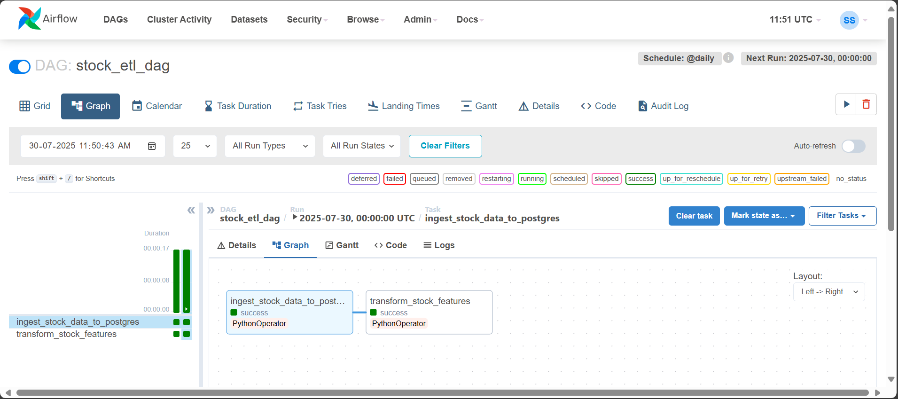

# AirStock - Stock ETL Pipeline using Airflow & PostgreSQL 

## 📝 Overview

This project implements a **robust and automated ETL (Extract, Transform, Load) pipeline** designed to process raw stock market data and prepare it for in-depth analysis. Leveraging industry-standard tools, the pipeline ensures data is consistently ingested, enriched with key financial indicators, and stored in a structured, query-ready format.

All services are containerized using **Docker Compose**, ensuring a consistent, isolated, and easily reproducible environment.

---

## 🚀 Key Features

- 🔄 **Automated Data Ingestion**: Seamlessly loads raw stock data from CSV files into a PostgreSQL database.  
- 🧮 **Data Transformation & Feature Engineering**: Calculates essential technical indicators like **SMA (Simple Moving Averages)** and **RSI (Relative Strength Index)**.  
- 📅 **Workflow Orchestration**: Uses **Apache Airflow** to schedule, manage, and monitor the ETL process.  
- 🗃 **Robust Data Storage**: Stores both raw and enriched data in **PostgreSQL**.  
- 🐳 **Containerized Environment**: Entire pipeline runs in **Docker** containers using Docker Compose.  
- 📊 **Analysis-Ready Output**: Produces clean, structured, and feature-rich tables for downstream analytics.



## 🧱 Architecture & Components

This project is orchestrated via **Docker Compose** and includes the following services:

### 🔹 `pg-db` (PostgreSQL)
- **Purpose**: Central data repository.
- **Technology**: `postgres:14` Docker image.

### 🔹 `airflow_init`
- **Purpose**: Initializes the Airflow metadata database and admin user.
- **Technology**: `apache/airflow:2.7.2-python3.9`

### 🔹 `airflow` (Airflow Webserver)
- **Purpose**: Hosts the Airflow UI for DAG monitoring and management.
- **Technology**: `apache/airflow:2.7.2-python3.9`

### 🔹 `airflow_scheduler`
- **Purpose**: Schedules and triggers DAG tasks.
- **Technology**: `apache/airflow:2.7.2-python3.9`

---
## 🔁 Data Flow

CSV Files → load_data_to_db.py → PostgreSQL (Raw Tables)
→ Airflow DAG → Data Transformation (SMA, RSI)
→ PostgreSQL (Feature Tables) → Ready for BI Tools


### 🧭 Steps:

1. **Raw Data**: CSV files (e.g., `AAKASH_NS_ENRICHED.csv`) placed in `stock_data/`.
2. **Initial Load**: Python script `load_data_to_db.py` inserts raw CSVs into PostgreSQL.
3. **DAG Triggered**: Airflow triggers `stock_etl_dag`.
4. **Ingestion Task**: Ensures raw tables are populated.
5. **Transformation Task**: Generates feature tables with technical indicators (`SMA_10`, `SMA_50`, `RSI_14`).
6. **Final Output**: Clean, enriched tables like `aakash_ns_features` ready for analysis.

---

## 🗂 Project Structure

stock_pipeline_project/
├── airflow/
│ └── dags/
│ └── stock_etl_dag.py
├── stock_data/
│ ├── AAKASH_NS_ENRICHED.csv
│ └── ... (more stock files)
├── docker-compose.yml
├── Dockerfile.airflow
├── requirements.txt
└── load_data_to_db.py

>---

## ⚙️ Setup & Running the Project

### ✅ Prerequisites

- Docker Desktop installed & running  
- Python 3.9+ (to run `load_data_to_db.py` script)


### Quick Start Guide

1.  **Place Raw CSV Data:**
    Add your raw stock data files (e.g., `AAKASH_NS_ENRICHED.csv`) into the `stock_data/` directory.

2.  **Build & Start Docker Services:**
    Navigate to your project's root directory in the terminal and run:

    ```bash
    docker-compose up --build -d
    ```

3.  **Initial Data Load (after PostgreSQL is ready):**
    Once your `pg-db` container is healthy, open a **new terminal** in the project root and run:

    ```bash
    python load_data_to_db.py
    ```

4.  **Access Airflow UI:**
    Open your web browser and go to: `http://localhost:8080`

    * **Username:** `admin`
    * **Password:** `admin`

5.  **Trigger the DAG:**
    In the Airflow UI:

    * Go to `stock_etl_dag`.
    * **Unpause** the DAG (toggle the switch).
    * Trigger a run manually by clicking the "Play" button icon.
    * Monitor progress in the Graph or Grid View until tasks turn green.

---

## 🛠 Technologies Used

* **Apache Airflow** (2.7.2) – Workflow orchestration
* **PostgreSQL** (14) – Relational database
* **Docker & Docker Compose** – Containerization
* **Python 3.9** – ETL scripting
* **Pandas** – Data manipulation
* **SQLAlchemy & Psycopg2** – PostgreSQL integration

---

## 🚧 Future Enhancements

* **📊 BI Integration:** Connect to Power BI / Tableau for advanced dashboards.
* **📡 Real-time Ingestion:** Implement real-time data fetching using APIs or Kafka.
* **🧠 Machine Learning:** Integrate and train predictive models for stock recommendations.
* **🔗 API-Based Sourcing:** Replace static CSVs with dynamic data from financial APIs.
* **📩 Alerting System:** Develop a system to trigger alerts based on specific stock conditions or indicator thresholds.

---

## 📎 License

This project is open-sourced under the MIT License.

---

## 🙋‍♀️ Author

**Sakshi Shastri**

* **Email:** 📫 [sakshishastri72@gmail.com](mailto:sakshishastri72@gmail.com)
* **LinkedIn:** 🔗 [LinkedIn Profile](https://www.linkedin.com/in/sakshi-shastri19) 
* **GitHub:** 🔗 [GitHub Profile](https://github.com/sakshis19)

